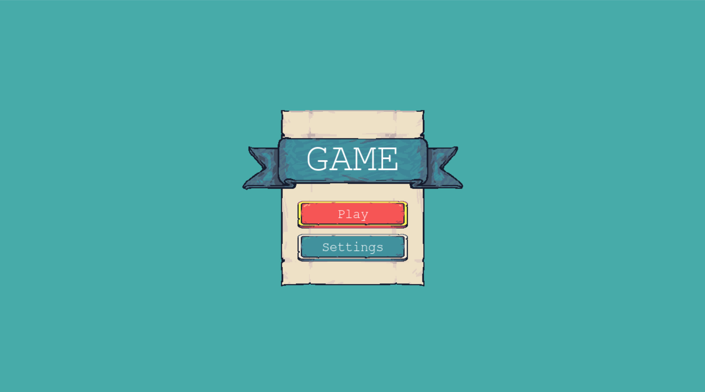
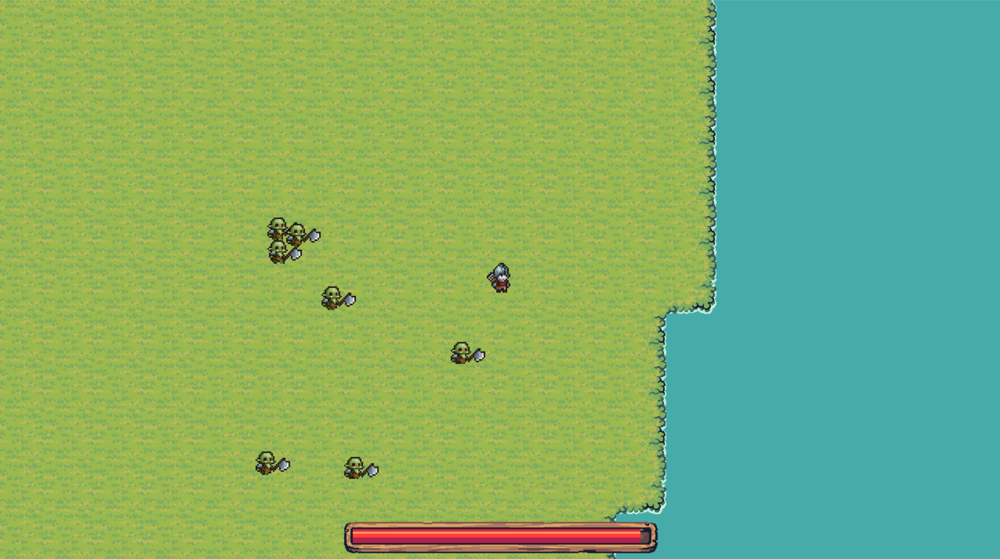
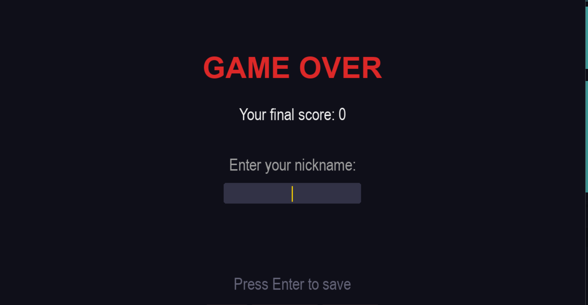

# 2D Vampire Survivors

## Project Description
Welcome to our 2D survival top-down shooter! Inspired by games like Vampire Survivors, the main goal is simple: survive as long as possible against endless waves of enemies. You can run around, collect experience coins, and get new abilities to help you stay alive. It's built entirely in Python using the Pygame library, showcasing a clean, object-oriented design.

## Features
* **Full Game States:** We have a working Start Menu, the main Play state, and a Game Over screen.
* **Smooth Movement & Physics:** We use Vector2 math to make the player's movement feel smooth and natural.
* **Accurate Collisions:** Custom collision hitboxes make sure that enemies hitting the player (or getting hit) is calculated perfectly.
* **Dynamic Animations:** We built custom animation classes to bring the player and enemies to life.
* **Smart Upgrades System:** As you level up, you get new abilities. We store these efficiently using an `acquired_upgrades` dictionary (storing by IDs for super-fast lookups!).
* **Data Saving:** High scores and settings are automatically read from and saved to JSON files.

## Technologies Used
* **Language:** Python 3
* **Library:** Pygame_ce
* **Architecture:** Object-Oriented Programming (OOP) with modular design.

## Installation Instructions
1. Make sure you have Python installed on your computer.
2. Clone this repository to your local machine.
3. Open your terminal or command prompt and install Pygame by running: python main.py

## Screenshots
Main Menu

Game process

Game over

## Team Member Roles
* **Nikita Bychkov: Worked on the core gameplay logic, animation and timer classes, collision hitboxes, and setting up the optimized data structures like the upgrades dictionary.

* **Zhumatayev Diyar: Worked on the project architecture, the core game loop, integrating the world generation system, ui elements, and the save/load systems.